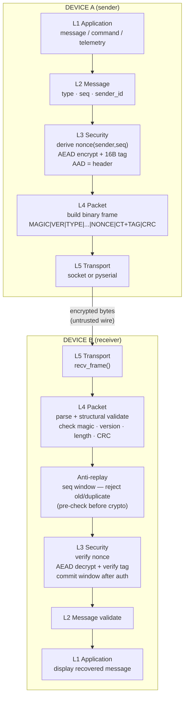

# Architecture

## Layer diagram

```
DEVICE A                                      DEVICE B
─────────────────────────────────────────     ─────────────────────────────────────────

┌─────────────────────────────────────┐       ┌─────────────────────────────────────┐
│  L1  APPLICATION                    │       │  L1  APPLICATION                    │
│  "HELLO DEVICE B", sensor data,     │       │  Message delivered to app           │
│  commands, telemetry                │       └────────────────────┬────────────────┘
└────────────────────┬────────────────┘                            │ message.decode()
                     │ encode                                       │
┌────────────────────▼────────────────┐       ┌────────────────────▼────────────────┐
│  L2  MESSAGE                        │       │  L2  MESSAGE VALIDATE               │
│  type, sequence, sender_id          │       │  check type, sender                 │
└────────────────────┬────────────────┘       └────────────────────┬────────────────┘
                     │                                              │
┌────────────────────▼────────────────┐       ┌────────────────────▼────────────────┐
│  L3  SECURITY (SEND)                │       │  L3  SECURITY (RECEIVE)             │
│  • derive nonce(sender_id, seq)     │       │  • verify nonce == derive(sender,seq)│
│  • AEAD encrypt(key, nonce, pt, aad)│       │  • anti-replay window check         │
│  • output: ciphertext + 16B tag     │       │  • AEAD decrypt + verify tag        │
└────────────────────┬────────────────┘       └────────────────────┬────────────────┘
                     │                                              │
┌────────────────────▼────────────────┐       ┌────────────────────▼────────────────┐
│  L4  PACKET (BUILD)                 │       │  L4  PACKET (PARSE)                 │
│  MAGIC|VER|TYPE|FLAGS|SENDER|KEY_ID │       │  • check MAGIC, VERSION             │
│  SEQ|NONCE|CT_LEN|CIPHERTEXT+TAG    │       │  • bounds check CT_LEN              │
│  |CRC32                             │       │  • check CRC (accidental errors)    │
└────────────────────┬────────────────┘       └────────────────────┬────────────────┘
                     │                                              │
┌────────────────────▼────────────────┐       ┌────────────────────▼────────────────┐
│  L5  TRANSPORT                      │       │  L5  TRANSPORT                      │
│  SocketClientTransport              │       │  SocketServerTransport              │
│  OR  UartTransport (pyserial)       │       │  OR  UartTransport (pyserial)       │
└────────────────────┬────────────────┘       └────────────────────▲────────────────┘
                     │                                              │
                     │     UART / socket — untrusted wire          │
                     └──────────────────────────────────────────────┘
```

## Mermaid



## Every block explained

### L1 Application
The actual data — sensor readings, commands, status. Neither the packet layer
nor the crypto layer knows anything about the application format.

### L2 Message
Adds metadata to the raw payload: message type (DATA/COMMAND/STATUS), sequence
number (increments every send), and sender identity. Sequence is the backbone
of both replay protection and nonce uniqueness.

### L3 Security
**Send side:**
1. Derive a 12-byte nonce from `(sender_id, sequence)` — deterministic,
   never repeats as long as the counter advances.
2. AEAD encrypt: pass `(key, nonce, plaintext, aad)` where `aad` is the
   serialized header. Output is `ciphertext || 16-byte authentication tag`.
3. The tag binds every header byte to the ciphertext. Change anything → tag
   fails on receive.

**Receive side:**
1. Pre-check the sequence against the sliding window (no commit yet).
2. Verify the nonce is the one the sender *should* have used.
3. AEAD decrypt: verifies the tag over `(ciphertext, aad)`. On `InvalidTag`
   → reject, log, discard. On success → commit the replay window and deliver
   plaintext to L2.

### L4 Packet
Binary framing. Provides a length-delimited frame so the receiver can read
exactly the right number of bytes. Also carries the nonce and associated data
fields in the clear (authenticated by the AEAD tag). The optional CRC32 catches
accidental bit errors on a noisy wire — it is not a security mechanism.

### Anti-replay
An IPsec-style sliding window (RFC 4303). Tracks the highest seen sequence and
a 64-bit bitmap of recent arrivals. The window is only committed *after* the
AEAD tag verifies — a forged packet cannot consume a sequence number.

### L5 Transport
**`SocketClientTransport` / `SocketServerTransport`** — TCP loopback socket on
`127.0.0.1:9999` for the simulated UART demo. No security at this layer;
confidentiality/integrity comes from the protocol above.

**`UartTransport`** (pyserial) — real hardware UART. Same interface, no code
changes above this layer.

Both transports use 4-byte length-prefixed framing so the receiver knows how
many bytes to read.
