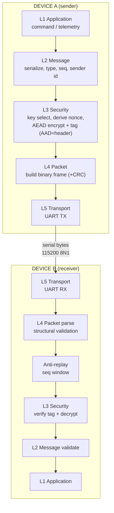

# Secure UART — Design & Engineering Specification

**Document type:** security-research prototype design
**Status:** PoC. Not production, not safety-critical, not defence-grade.
**Audience:** a senior embedded / security engineer who will review and challenge it.
**Date:** 2026-10-07

This document is the "what and why". The runnable "how" is
[`secure_uart.py`](../secure_uart.py); the beginner walk-through is
[`GUIDANCE.md`](../GUIDANCE.md).

---

## Table of contents

1. [Problem & objective](#1-problem--objective)
2. [System architecture (layers)](#2-system-architecture-layers)
3. [Detailed block-by-block architecture](#3-detailed-block-by-block-architecture)
4. [Security architecture & boundaries](#4-security-architecture--boundaries)
5. [Packet format](#5-packet-format)
6. [Cryptographic architecture & comparison](#6-cryptographic-architecture--comparison)
7. [Authenticated encryption (why AEAD)](#7-authenticated-encryption-why-aead)
8. [Replay protection](#8-replay-protection)
9. [Key management](#9-key-management)
10. [Threat model](#10-threat-model)
11. [UART transport](#11-uart-transport)
12. [Why this approach (design Q&A)](#12-why-this-approach-design-qa)
13. [ROS 2 integration](#13-ros-2-integration)
14. [MCU migration](#14-mcu-migration)
15. [Production hardening checklist](#15-production-hardening-checklist)
16. [One-page summary](#16-one-page-summary)
17. [References](#17-references)

---

## 1. Problem & objective

Two embedded devices need to exchange commands/telemetry over a simple serial
(UART) wire. UART provides **transport only** — raw bytes, no security. A
passive attacker with a logic analyzer on the two wires can read everything; an
active attacker can modify, replay, inject, or forge bytes.

**Objective:** add a thin security layer on top of UART that provides
confidentiality, integrity, authenticity, and replay protection, is simple
enough to migrate to a constrained MCU, and is honest about its limits.

**Non-goal:** this does not attempt key agreement (no Diffie-Hellman handshake),
certificate PKI, or secure boot. It assumes a **pre-shared symmetric key** was
provisioned out of band. Those richer schemes are discussed but out of PoC scope.

---

## 2. System architecture (layers)

Five logical layers on each device. Each layer has one job and a clean
interface, so the crypto can change without touching the packet code, and the
transport (simulated UART → real UART → USB-CDC) can change without touching
either.

```
 LAYER 1  APPLICATION     sensor value / command / status / transaction
 LAYER 2  MESSAGE         serialize, type, sequence number, sender id
 LAYER 3  SECURITY        key select, nonce, AEAD encrypt, auth tag
 LAYER 4  PACKET          header | nonce | ciphertext | tag | (crc)
 LAYER 5  TRANSPORT       UART / serial bytes on the wire
```

### Mermaid



### ASCII (end to end)

```
        DEVICE A                                   DEVICE B
   +------------------+                       +------------------+
   | L1 Application   |                       | L1 Application   |
   +--------+---------+                       +--------^---------+
            v                                          |
   +------------------+                       +--------+---------+
   | L2 Message       |                       | L2 Msg validate  |
   +--------+---------+                       +--------^---------+
            v                                          |
   +------------------+                       +--------+---------+
   | L3 Security AEAD |                       | L3 Verify+Decrypt|
   +--------+---------+                       +--------^---------+
            v                                          |
   +------------------+                       +--------+---------+
   | L4 Packetize     |                       | Anti-replay      |
   +--------+---------+                       +--------^---------+
            v                                          |
   +------------------+                       +--------+---------+
   | L5 UART TX       |                       | L4 Packet parse  |
   +--------+---------+                       +--------^---------+
            |                                          |
            |              UART  TX->RX                |
            +----------------->-----------------------+
```

---

## 3. Detailed block-by-block architecture

**L1 — Application.** Produces/consumes the meaningful payload (e.g.
`TRANSACTION_ID=1234,TEMP=35.4,STATUS=ACTIVE`). It does not know about crypto.

**L2 — Message.** Chooses a message **type** (data/command/status/heartbeat),
assigns the next **sequence number** (monotonic, never reused), and tags the
**sender id**. In the PoC the payload is already bytes; a real system would
serialize a struct (e.g. CBOR/Protobuf) deterministically here.

**L3 — Security.** Selects the key by **key id**, **derives the nonce** from
`(sender_id, sequence)`, and performs **AEAD** (encrypt + authenticate). The
packet header is passed as **Associated Data (AAD)** so it is authenticated but
left readable. Output = `ciphertext || 16-byte tag`.

**L4 — Packet.** Lays the fields out as a fixed binary frame (see §5), appends
an optional CRC32. On receive it does **structural validation first** — magic,
version, length consistency, integer-overflow-safe bounds — before any crypto.

**L5 — Transport.** Pushes/pulls bytes over UART. In the PoC this is an
in-memory loopback (`SimulatedUART`); swapping in `pyserial` or an MCU UART
driver changes nothing above it.

**Receive-side extra block — Anti-replay.** Between parse and decrypt, the
sequence number is checked against a sliding window. The window is only
*committed* after the tag verifies, so a forged packet cannot poison it.

---

## 4. Security architecture & boundaries

```
        TRUSTED DEVICE A                         TRUSTED DEVICE B
        (holds shared key)                       (holds shared key)
              |                                          ^
              v                                          |
        Device identity (sender id)             Message delivered to app
              |                                          ^
              v                                          |  trust re-established
        Key material (key_id -> key)            Decrypt (AEAD open)
              |                                          ^
              v                                          |  authenticity proven
        Nonce (derived from seq)                Authentication verify (tag)
              |                                          ^
              v                                          |  structure sane
        AEAD encrypt + tag                      Anti-replay (seq window)
              |                                          ^
              v                                          |
        Secure packet  --------- UART (UNTRUSTED) ------> Packet parse
                         the whole wire is attacker space
```

**Trust boundary = the crypto, not the wire.** Everything on the UART is
assumed attacker-controlled. Trust only re-enters Device B *after* the AEAD tag
verifies. Each receive stage narrows what can pass:

| Stage | Rejects | Trust gained |
|-------|---------|--------------|
| Packet parse | malformed / wrong-length / wrong-magic frames | "this is structurally a frame" |
| Anti-replay | duplicates and old packets | "this seq is fresh" (tentatively) |
| AEAD verify | tamper, wrong key, forgery | "authentic + untampered" (real trust) |
| Message validate | semantically invalid payloads | "safe to act on" |

---

## 5. Packet format

Big-endian ("network order") so it is portable to any MCU. Header = 30 bytes,
authenticated as AAD. The 16-byte tag is the last 16 bytes of the ciphertext
field.

```
offset field        size  notes
------ -----------  ----  --------------------------------------------------
  0    MAGIC         2    0x53 0x55 ("SU"). Frame sync / quick reject.
  2    VERSION       1    0x01. Forward compatibility.
  3    TYPE          1    data/command/status/heartbeat. Classification.
  4    FLAGS         1    bit0 = CRC present. Options without a version bump.
  5    SENDER_ID     2    which device sent this. Also feeds the nonce.
  7    KEY_ID        1    which provisioned key. Enables key rotation.
  8    SEQUENCE      8    monotonic counter. Replay detection + nonce source.
 16    NONCE        12    96-bit AEAD nonce (sender||0000||seq).
 28    CT_LEN        2    length of CIPHERTEXT (incl. tag). Bounds the parse.
------ ----- header ends at offset 30 (all of the above is AAD) ------------
 30    CIPHERTEXT  var    encrypted payload || 16-byte auth tag
 ..    CRC32         4    optional, over header+ciphertext. NOT security.
```

### ASCII frame

```
+--------+-----+------+-------+-----------+--------+
| MAGIC  | VER | TYPE | FLAGS | SENDER_ID | KEY_ID |
|  2B    | 1B  | 1B   | 1B    |   2B      |  1B    |
+--------+-----+------+-------+-----------+--------+
|            SEQUENCE NUMBER (8B)                  |
+-------------------------------------------------+
|                 NONCE (12B)                     |
+--------------------------+----------------------+
|       CT_LEN (2B)        |  <-- end of header (AAD = bytes 0..29)
+--------------------------+----------------------+
|        CIPHERTEXT  (variable)  ... || TAG (16B) |
+-------------------------------------------------+
|              CRC32 (4B, optional)               |
+-------------------------------------------------+
```

### Field justification

- **MAGIC** — lets a receiver resync to a frame boundary on a noisy stream and
  reject non-frames cheaply. Not security (an attacker can copy it).
- **VERSION** — so a v2 device can refuse or adapt to a v1 peer. Avoids silent
  misinterpretation.
- **TYPE** — the app dispatches on it; also lets a policy say "commands need a
  stricter key".
- **FLAGS** — room to add options (compression, CRC on/off, fragmentation)
  without burning a version number.
- **SENDER_ID** — identifies the sender and is mixed into the nonce so two
  devices sharing a key can never collide nonces.
- **KEY_ID** — supports multiple provisioned keys → enables rotation and
  revocation (switch id, old packets fail).
- **SEQUENCE** — the backbone of both replay protection *and* nonce uniqueness.
  64-bit so it never wraps in practice.
- **NONCE** — required by the AEAD. Transmitted for clarity/debuggability and
  re-derived + checked by the receiver (so it can't be a reuse vector).
- **CT_LEN** — the only length the parser trusts; every bounds check keys off
  it, overflow-safe.
- **CIPHERTEXT (incl. TAG)** — the confidential payload and its cryptographic
  integrity/authentication tag.
- **CRC32** — detects *accidental* line corruption so we can distinguish "noisy
  wire" from "active attack". **Never** treated as security; the AEAD tag is the
  only integrity guarantee that matters against an adversary.

**Overhead:** 30 (header) + 16 (tag) + 4 (CRC) = **50 bytes** per frame on top
of the payload. For a 64-byte payload that is a 114-byte frame.

---

## 6. Cryptographic architecture & comparison

We compared five options. We do **not** choose on popularity, and we **never
implement primitives ourselves** — we use the audited `cryptography` library.

| Property | AES-256-GCM | Ascon-AEAD128 | ChaCha20-Poly1305 | AES-CTR + HMAC | Encrypt-only |
|---|---|---|---|---|---|
| Confidentiality | ✅ | ✅ | ✅ | ✅ | ✅ |
| Integrity + auth | ✅ (built-in) | ✅ (built-in) | ✅ (built-in) | ✅ (if done right) | ❌ |
| Single-pass AEAD | ✅ | ✅ | ✅ | ❌ (2 primitives, encrypt-then-MAC) | — |
| No HW AES needed | ❌ slow/§unsafe in SW | ✅ | ✅ (SW-friendly) | ❌ | — |
| HW acceleration | ✅ (AES-NI / MCU AES) | emerging | rare | partial | — |
| RAM / code size | medium | **very small** | small | larger (2 algos) | small |
| Nonce misuse risk | **high** (catastrophic) | high | high | high | — |
| Tag / overhead | 16 B | 16 B | 16 B | 32 B (HMAC-256) or 16 (trunc) | 0 |
| Standard | NIST SP 800-38D | **NIST SP 800-232** | IETF RFC 8439 | FIPS pieces | — |
| Python (`cryptography`) | ✅ | ❌ (not yet) | ✅ | ✅ (compose) | ✅ |
| Constrained-MCU fit | ok w/ HW AES | **best** | **best w/o HW AES** | heavier | n/a |
| Lightweight-crypto std | — | ✅ winner | — | — | — |

**Recommendation for this PoC: ChaCha20-Poly1305.**

- One audited AEAD, hard to misuse, no HW-AES dependency, excellent in pure
  software (important for MCUs without an AES block), 16-byte overhead,
  IETF-standard (RFC 8439), and present in Python's `cryptography`.
- **AES-256-GCM** is the right pick when the target MCU has an AES hardware
  block (use the HW to also dodge software-AES timing side channels). Selectable
  in the code via `algorithm="aes-256-gcm"`.
- **Ascon-AEAD128** is the forward path for the smallest/most-constrained
  targets: it is NIST's Lightweight Cryptography winner, standardized in
  **SP 800-232 (2025)**. It isn't in Python's `cryptography` yet, so it is
  documented as the migration target rather than used in the PoC.
- **AES-CTR + HMAC** works (encrypt-then-MAC) but is two primitives, more code,
  bigger tag, and easier to assemble wrongly. No reason to prefer it here.
- **Encrypt-only** is rejected outright — see §7.

---

## 7. Authenticated encryption (why AEAD)

Encryption alone hides data but does **not** detect modification. An attacker
can flip ciphertext bits and the receiver will happily "decrypt" into attacker-
influenced plaintext.

```
encryption only:          AEAD:
  plaintext                 plaintext
     |                         |
  encrypt                   AEAD(key, nonce, plaintext, AAD=header)
     |                         |
  ciphertext                ciphertext + 16-byte AUTH TAG
  (no integrity!)           (change ANY bit -> tag check fails -> reject)
```

AEAD gives three properties in one operation:

- **Confidentiality** — the payload is encrypted.
- **Integrity** — any change to ciphertext or header is detected.
- **Authentication** — only a key holder could have produced a valid tag.
- **Associated Data (AAD)** — the header is authenticated but not encrypted, so
  routing fields stay readable yet un-tamperable.
- **Nonce** — a per-message number that must never repeat for a key.
- **Tag** — the 128-bit value that binds all of the above together.

**What happens when one ciphertext byte changes?** The receiver recomputes the
tag over the altered data, it does not match, and decryption raises
`InvalidTag` → the packet is rejected and nothing reaches the application. This
is exactly TEST 2 in the code (and we recompute the CRC there to prove it's the
*cryptographic* tag doing the rejecting, not the CRC).

---

## 8. Replay protection

A valid, authentic packet that is **captured and re-sent** still has a valid
tag — AEAD alone cannot stop it. We bind freshness with the **sequence number**.

```
A sends:   seq=100   seq=101   seq=102
attacker captures 101 and re-sends it later:
             seq=101  ->  Device B  ->  REJECTED (already seen)
```

**Mechanism (IPsec anti-replay, RFC 4303 App. A):** the receiver keeps the
highest sequence accepted plus a 64-bit bitmap of the recent window.

| Situation | Behaviour |
|---|---|
| Duplicate (same seq twice) | rejected |
| Old packet (below the window) | rejected |
| Out-of-order but inside window, first time | accepted |
| Packet loss (gaps) | fine — gaps allowed |
| Reorder beyond window | rejected (treated as too-old) |

**Why not timestamps alone?** Clocks drift, devices reboot, and an attacker can
replay within the allowed clock skew. Timestamps can *supplement* a counter but
must not be the only mechanism.

**Reboot / counter persistence.** The sequence counter is also the nonce source,
so a reboot that resets it to 0 would reuse nonces — forbidden. Two safe
options: (a) **persist the counter to flash** and resume above the last value,
or (b) **rotate/derive a fresh session key on each boot** (e.g. via a boot nonce
exchange) so the counter may safely restart. The PoC assumes a long-lived
process; a real device must do (a) or (b). This is called out in §14.

---

## 9. Key management

```
Device identity
      v
Provisioning (factory / secure facility, out of band)
      v
Key storage  (prototype: env/file;  production: secure element / protected flash)
      v
Key ID        (names which key is in use -> rotation & revocation)
      v
Encryption    (AEAD uses the selected key)
      v
Key rotation  (issue new key id, retire old)
      v
Key revocation (receiver drops a key id -> all its packets fail)
```

**Prototype storage (this PoC):** the key is generated at runtime with
`os.urandom(32)` (a CSPRNG) and held in memory. There are **no hard-coded
secrets**. For a repeatable demo you could load a key from an environment
variable or a file with locked-down permissions — acceptable for a prototype,
**not** for production.

**Production storage:** the private key material should live where firmware can
*use* it but not *export* it:

- **Secure Element** (e.g. ATECC608, SE050) — key generated on-chip, operations
  happen inside the chip, key never leaves.
- **TPM** — on richer compute modules; sealed keys, attestation.
- **MCU with crypto + protected flash** — key in read-protected flash, crypto
  via the on-chip accelerator; enable readout protection (RDP/flash protection).
- **Key derivation (HKDF)** — derive per-purpose/per-session keys from a root
  key so one leaked session key doesn't expose everything.
- **Rotation** — provision multiple keys / derive session keys; advance `KEY_ID`.
- **Revocation** — the receiver removes a compromised `KEY_ID`; its traffic then
  fails authentication.
- **Provisioning** — inject keys in a controlled facility, ideally never leaving
  the secure element; record device identity ↔ key id binding.

---

## 10. Threat model

Attacker is assumed to fully control the UART wire (read/modify/inject/replay).

| # | Attack | Control | Expected result | Residual limitation |
|---|--------|---------|-----------------|---------------------|
| 1 | Sniff UART traffic | AEAD confidentiality | payload unreadable | traffic metadata (timing, size, frequency) still observable |
| 2 | Modify a packet | AEAD integrity (tag) | rejected (`InvalidTag`) | — |
| 3 | Replay a valid packet | sequence + replay window | rejected (old/duplicate) | counter must persist across reboot |
| 4 | Inject new packets | AEAD authentication | rejected (bad tag) | — |
| 5 | Forge a packet | no key → no valid tag | rejected | holds only while the key is secret |
| 6 | Malformed packet | defensive parse, bounds checks | rejected, no crash | — |
| 7 | Wrong key | tag verification fails | rejected | — |
| 8 | Impersonate a device | sender id is in AAD + needs the key | rejected (bad tag) | identity == key secrecy, not a certificate |
| 9 | Timing / traffic analysis | — | **not** prevented | needs padding / cover traffic / constant-rate |

**Beyond the wire — explicitly out of scope for crypto alone:**

- **Physical device compromise / stolen key** → whoever holds the key *is* the
  device. Mitigate with secure elements (non-exportable keys), tamper response,
  per-device keys so one loss ≠ fleet loss.
- **Compromised / unsigned firmware** → needs **secure boot + firmware signing**.
- **Side-channel (power/EM/timing) & fault injection** → needs HW countermeasures
  and constant-time primitives (another reason to use HW AES / vetted libs).
- **Debug-port attacks (JTAG/SWD)** → lock/disable debug in production.
- **Supply-chain tampering** → provisioning controls, attestation, signing.

> **Stated plainly: cryptographic communication does not solve all of these.**
> It secures the link; it does not secure the endpoints or the supply chain.

---

## 11. UART transport

UART is a point-to-point async serial link: two data wires plus a common ground.

```
  Device A                         Device B
   TX  >------------------------->  RX
   RX  <-------------------------<  TX
   GND ------------------------- GND   (common ground is mandatory)
```

- **Baud rate** — symbols/sec; both sides must agree. PoC uses **115200**.
- **Data bits / parity / stop** — **8N1** = 8 data bits, No parity, 1 stop bit.
  So each byte costs ~10 bit-times on the wire (1 start + 8 data + 1 stop).
- **Flow control** — none in the PoC; add RTS/CTS if the receiver can stall.
- **Framing / packet boundaries** — UART delivers a byte stream with no inherent
  message boundaries. We recover frames with the `MAGIC` marker + the `CT_LEN`
  length field (read header → read exactly `CT_LEN` (+CRC) more bytes).

UART provides **transport and signalling only**. It provides **no** encryption,
authentication, authorization, or replay protection — that is entirely this
protocol's job.

---

## 12. Why this approach (design Q&A)

- **Why not plain UART?** Zero security: anyone on the wire reads, edits, and
  injects freely.
- **Why not encryption only?** Hides data but doesn't detect tampering; bit-flips
  silently corrupt into attacker-chosen plaintext (§7).
- **Why not CRC only?** CRC catches *accidental* errors; it is trivially
  recomputed by an attacker. It is error-detection, not security.
- **Why not HMAC only?** Authenticates but doesn't hide the payload. We need
  confidentiality *and* authenticity → AEAD.
- **Why not TLS?** TLS assumes a reliable, framed, bidirectional stream and a
  PKI handshake — heavy for a raw UART and a tiny MCU. A pre-shared-key AEAD
  record format is the right weight here. (TLS/DTLS becomes reasonable over IP.)
- **Why AES-GCM?** Standard, fast *with* hardware AES; good when the MCU has an
  AES block.
- **Why ChaCha20-Poly1305?** Fast and safe in pure software, no HW-AES needed —
  the PoC default.
- **Why Ascon?** NIST Lightweight-Crypto winner (SP 800-232) for the most
  constrained targets — the migration path.
- **Why AEAD at all?** One audited operation gives confidentiality + integrity +
  authentication and binds the header via AAD.
- **Why sequence numbers?** Freshness/replay protection *and* nonce uniqueness.
- **Why separate packet and security layers?** So the wire format and the crypto
  evolve independently and each is independently testable.
- **Why separate embedded-link security from ROS 2 / DDS security?** They protect
  different segments (the MCU↔compute wire vs. the ROS 2 network). See §13.

---

## 13. ROS 2 integration

```
                         ROBOT
                           |
         +-----------------+------------------+
         |                                    |
    Embedded MCU                         ROS 2 Computer
         |                                    |
  THIS secure UART link                  ROS 2 nodes
         |                                    |
         +-----------------+------------------+
                           |
                   DDS / DDS-Security
                           |
                   Network / control
                           |
                     Command center
```

**These are three different layers protecting three different segments:**

- **Embedded link security (this PoC)** — protects the MCU ↔ ROS 2 computer
  serial wire, below ROS.
- **ROS 2 / DDS security** — protects messages between ROS 2 nodes over the
  network.
- **Network security** — protects the broader IP network / uplink.

**DDS-Security & SROS 2** (what to use on the ROS side): the DDS-Security spec
defines plugins for **authentication** (X.509 identity certificates), **access
control** (per-node permissions via signed governance/permissions files),
**cryptographic** protection (encryption + authentication of DDS traffic),
logging, and data tagging. **SROS 2** is the ROS 2 tooling (`ros2 security`)
that creates **security enclaves** — a keystore of identity/permission
certificates per node or group.

**When to use both:** use the embedded-link layer for anything riding the UART
to/from the MCU (which DDS never touches), and SROS 2/DDS-Security for node-to-
node traffic on the ROS graph. A command from the command center is then
protected network-side by DDS-Security and, once it crosses onto the serial
wire to the MCU, by this protocol. Neither layer replaces the other.

---

## 14. MCU migration

```
Python PC prototype -> USB-UART -> MCU dev board -> HW crypto
                    -> secure key storage -> real embedded system
```

The layering is deliberately portable. Migration notes:

- **Crypto** — switch to the MCU's **AES hardware** (use AES-GCM) or a vetted
  software **ChaCha20-Poly1305**, or **Ascon** for the smallest targets. Keep
  using an *audited* implementation; do not hand-roll.
- **RAM / flash** — a software AEAD is a few KB of code and tiny RAM; budget it.
- **CPU cycles / latency** — measure on the target; **Python numbers do not
  represent MCU performance** (see the perf section's disclaimer).
- **UART throughput** — real throughput < baud rate because of 8N1 framing, the
  50-byte protocol overhead, and inter-frame gaps.
- **Sequence-counter persistence** — persist the counter to flash, or derive a
  fresh session key per boot, so nonces never repeat after reset (§8).
- **Power** — crypto wakes the CPU; batch/aggregate if energy-constrained.
- **Secure boot & firmware signing** — verify firmware authenticity at boot.
- **Debug-port protection** — disable/lock JTAG/SWD and enable flash readout
  protection in production.
- **Key storage** — move the key into a secure element / protected flash (§9).

---

## 15. Production hardening checklist

- [ ] No hard-coded secrets; keys in a secure element / protected flash.
- [ ] Keys generated by a vetted CSPRNG / on-chip; never exported.
- [ ] Per-device keys so one compromise ≠ fleet compromise.
- [ ] Sequence counter persisted (or per-boot session keys) to prevent nonce reuse.
- [ ] Key rotation and revocation procedure defined and tested (`KEY_ID`).
- [ ] AEAD from an audited library; constant-time / HW-backed where possible.
- [ ] Secure boot + signed firmware.
- [ ] Debug ports (JTAG/SWD) disabled/locked; flash readout protection on.
- [ ] Defensive parsing fuzzed; bounded buffers; no crash on hostile input.
- [ ] No plaintext, keys, or nonces in logs.
- [ ] Dependency pinning + vulnerability scanning.
- [ ] Rate limiting / backoff on repeated auth failures.
- [ ] Physical tamper response where the threat model needs it.
- [ ] Independent security review before any deployment.

---

## 16. One-page summary

> **Problem:** UART is an insecure byte pipe between two devices.
> **Solution:** a pre-shared-key AEAD record protocol over UART.
> **Crypto:** ChaCha20-Poly1305 (RFC 8439), AES-256-GCM selectable, Ascon
> (SP 800-232) as the constrained-target path. Never hand-rolled.
> **Packet:** `MAGIC|VER|TYPE|FLAGS|SENDER|KEY_ID|SEQ|NONCE|CT_LEN | CT‖TAG | CRC`.
> Header authenticated as AAD. 50-byte overhead.
> **Nonce:** derived from `(sender, seq)` → never reused.
> **Replay:** monotonic 64-bit seq + 64-entry sliding window; committed only
> after the tag verifies.
> **Keys:** prototype = CSPRNG in memory; production = secure element / protected
> flash, with rotation + revocation via `KEY_ID`.
> **Threats handled on the wire:** sniff, modify, replay, inject, forge,
> malformed, wrong-key, impersonation. **Not** handled by crypto alone: physical
> compromise, stolen keys, bad firmware, side-channel/fault, debug ports,
> supply chain, traffic analysis.
> **Status:** prototype — not production, not safety-critical, not defence-grade.

---

## 17. References

Authoritative sources (verify the latest revisions when you build on this):

- **NIST SP 800-38D** — Galois/Counter Mode (GCM) and GMAC.
- **NIST SP 800-232 (2025)** — Ascon-based lightweight cryptography standard
  (NIST Lightweight Cryptography winner).
- **NIST SP 800-90A/B/C** — random bit generation (CSPRNG guidance).
- **NIST SP 800-57** — key-management recommendations.
- **IETF RFC 8439** — ChaCha20 and Poly1305 for IETF protocols (AEAD).
- **IETF RFC 5116** — an interface and algorithms for authenticated encryption.
- **IETF RFC 4303** — IP ESP (sliding-window anti-replay, Appendix A).
- **IETF RFC 5869** — HKDF (key derivation).
- **OMG DDS-Security** — DDS security plugins (auth, access control, crypto).
- **ROS 2 documentation / SROS 2** — `ros2 security`, security enclaves, DDS-Security.
- **OWASP** — Embedded/IoT security guidance and testing.
- **Poly1305 / AEAD misuse literature** — on the catastrophic cost of nonce reuse.
